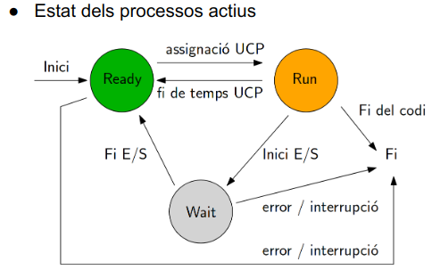

# Components de la Gestió de Processos
La gestió de processos en sistemes informàtics es compon de diversos elements essencials que contribueixen al seu funcionament eficient. Aquí, ens centrarem en quatre components clau: els **estats del procés**, la **gestió de memòria**, la **planificació de CPU** i la **sincronització i comunicació**.
## Estats del Procés
Els processos passen per diferents estats al llarg del seu cicle de vida, i la gestió efectiva d'aquests estats és essencial per a un sistema operatiu eficient. Aquí es descriuen alguns dels estats més rellevants:
1. **Nou:** El procés acaba de ser creat i encara no s'ha iniciat la seva execució.
2. **Preparat:** El procés està llest per ser executat, però encara no ha obtingut l'ús de la CPU.
3. **En Execució:** El procés està ocupant la CPU i realitzant les seves tasques assignades.
4. **Bloquejat:** El procés està a l'espera d'un esdeveniment extern, com ara l'entrada de l'usuari o una operació d'entrada/sortida.
5. **Finalitzat:** El procés ha completat la seva execució i ha finalitzat.
La gestió efectiva entre aquests estats implica transicions adequades i optimitzades, assegurant que els processos es mouen entre ells de manera eficient per mantenir un sistema dinàmic i actiu.

## Gestió de Memòria
La **gestió de memòria** és un altre component crític de la gestió de processos, ja que implica l'assignació i alliberament d'espai de memòria per als processos. Alguns conceptes clau inclouen:
1. **Assignació de Memòria:** Determinar quanta memòria assignar a cada procés per garantir que tingui prou espai per emmagatzemar les seves dades i instruccions.
2. **Alliberament de Memòria:** Alliberar l'espai de memòria quan un procés finalitza, assegurant una utilització eficient dels recursos del sistema.
3. **Fragmentació:** Evitar la fragmentació de la memòria, ja que pot afectar negativament l'eficiència del sistema. Això inclou la fragmentació interna i externa.
La gestió de memòria és crucial per evitar problemes com ara esgotament de recursos i assegurar un ús òptim de l'espai disponible.
## Planificació de CPU
La **planificació de CPU** implica determinar quin procés s'executarà següent, amb l'objectiu de maximitzar l'ús del temps de CPU i minimitzar els temps d'espera dels processos. Una correcta planificació contribueix a un rendiment eficient del sistema i una resposta ràpida als usuaris.
## Sincronització i Comunicació
La **sincronització i comunicació** són essencials per coordinar l'execució de processos i evitar problemes com ara condicions de carrera. La sincronització assegura l'ordre adequat d'operacions, mentre que la comunicació facilita l'intercanvi d'informació entre processos.

Aprofundir en aquests components proporciona una visió completa de com els sistemes operatius gestionen els processos, assegurant un funcionament eficient i coordinat.
[Anterior pàgina](Objectius.md)  
[Seguent pàgina](Conclussio.md)